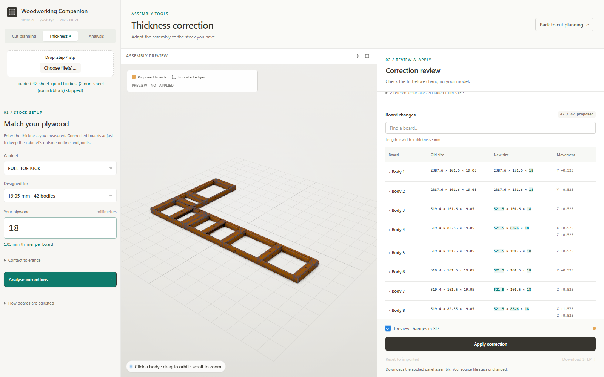

# Woodworking Companion

A browser app for cabinet builders and woodworkers.
Drop one or more STEP files → pick the panel bodies → get optimized cut
sheets, a shopping list, edge-banding totals, cost rollups, DXF/PDF cut
plans, and per-sheet cut instructions.

STEP import, measured-stock correction, nesting, and exports run in the
browser: OpenCascade (WASM), TypeScript, and Three.js. Structural analysis
can also use the optional [local solver service](server/README.md).

---

## Run

### Windows
Double-click `launch.bat`. First run installs deps; subsequent runs just
start the dev server and open the browser.

### macOS
First time only, in Terminal:
```sh
chmod +x launch.command
```
Then double-click `launch.command` in Finder.

### Manual
```sh
cd app
npm install
npm run dev
```
Open <http://localhost:5173/>.

Requires Node 18 or newer.

Run optimizer, thickness-correction, and STEP round-trip tests with `npm test` from `app/`. To benchmark a
local model using the same STEP analysis and nesting pipeline, run
`node tests/step_bench.mjs "path/to/model.stp" 256` from the repository root.
Results are saved under `tests/_output/`; saw-setting counts exclude reference trims.
For thickness correction and corrected-CAD verification, run
`node tests/thickness_bench.mjs "path/to/model.stp" 18`.
This writes a corrected STEP and before/after report under `tests/_output/`,
then re-imports the STEP to check dimensions, contacts, and outside references.

### Update notice
On launch the app asks GitHub how the running build compares to the repo's
`master`, and if it is behind, shows a strip under the title with the number
of commits and a **Download** link to the current source zip. Dismiss hides it
until there is a newer commit than the one dismissed.

It uses the *compare* endpoint rather than matching commit hashes, so having
unpushed local commits reads as "ahead" and says nothing, instead of nagging
you to download a build older than the one you are running. Offline, rate
limited, or a commit GitHub has never seen: all silent. The answer is cached
for six hours so a dev session's reloads don't spend the unauthenticated rate
limit — which also means a fresh release can take up to six hours to appear.
The request is an unauthenticated read of a public repo; nothing about your
job leaves the machine.

---

## Features

### Choose a workspace

| Workspace | Use it for | Main result |
|---|---|---|
| **Cut planning** | Select panels, set stock and grain, then estimate | Cut layouts, shopping list, and cutting exports |
| **Thickness** | Adapt a cabinet to measured plywood thickness | Reviewed board changes and a corrected STEP assembly |
| **Analysis** | Detect joints, set loads, and solve the assembly | Structural mesh, deflection/stress results, and analysis PDF |

The workspaces share the imported model. A typical sequence is **Import →
Thickness → Apply → Cut planning → Estimate**. Run structural analysis again
after changing geometry. Switching tabs alone does not apply a correction.

See the [Thickness workspace guide](docs/THICKNESS-CORRECTION.md) for a
step-by-step walkthrough, screenshots, table columns, and troubleshooting.

### Import
- **Multi-file STEP** — drop several `.step`/`.stp` files in a row; each
  file's bodies append to the model with the file name as a prefix.
- **Auto-layout** — additional files are translated along +X (cumulative
  width + a 100 mm gap) and snapped down so each file's lowest point sits
  on the floor (`z=0`).
- **Non-sheet-good filter** — round legs, dowels, blocks etc. are
  detected (thinnest extent outside the 1/8" – 1" plywood range or not
  meaningfully thinner than the other two) and rendered in red dashed in
  the 3D view, but excluded from the cut list. Body count shows
  `N sheet / M total` so you can see what was skipped.

### 3D viewer
- **Z-up world** (STEP convention) with Three.js, GTAO, OutlinePass,
  SMAA, MSAA × 4 multisampled composer target, 4K shadow maps, Khronos
  PBR Neutral tone mapping.
- **Click-to-select** bodies; selected bodies pop with a white halo and
  the rest dim but stay readable via the edge overlay.
- **24 hand-picked distinct colors** + HSL fallback for jobs past 24
  parts.
- **Two-layer edge overlay**: sharp creases dark, tangential transitions
  light.
- **Grain arrows** on both flat faces of each selected body at the panel
  centroid. Color/shape codes the grain state. Click an arrow to cycle
  free → length → width.

### Analysis
- **Body analysis** (`geometry.ts`) computes thickness, in-face length
  and width, and a 2D polygon outline of the part's flat face. World-axis
  AABB is the fast path; PCA-OBB is the fallback for tilted panels.
- **Auto-orient** rotates the outline polygon so its dominant edge
  direction is axis-aligned with the sheet — angled cuts are minimized.

### Measured stock thickness correction



Open the **Thickness** workspace beside Cut planning and Analysis, select a cabinet and its source stock group,
enter the actual thickness in millimetres, and choose **Analyse corrections**.
The solver finds face contacts, holds the outside outline and exposed recess
references, and resizes or shifts the connected boards to retain the joints.
For 19.05 mm stock changing to 18 mm, an intervening rail may grow by 2.10 mm;
the allowance follows the actual assembly, including stacked board layers.

Review the searchable table of **Old size**, **New size**, and **Movement**;
expand a board name for the joint explanation. Stock settings, a large 3D view,
and the change report have their own areas. Apply, reset, and export stay visible
while the report scrolls. Preview the proposal in 3D, then **Apply correction**.
Switching workspaces clears the temporary preview but keeps the proposal.
The viewer and cutting inputs update together;
stale nesting and structural results are cleared. **Reset to imported** restores
the source geometry. Each analysis starts from that original baseline, and
applying replaces the previous correction for that cabinet.

**Download STEP** exports the applied panel assembly in its source
coordinates, undoing the viewer's display offsets. The source file is untouched.
Automatic edits currently support verified rectangular solids sharing an
orthogonal assembly frame. Shaped joinery, unsupported solids, conflicting
outside constraints, and ambiguous anchors block application for CAD review.
Zero-thickness reference surfaces are listed and excluded from panel-solid export.
Internal clear openings may change as the stock changes.

### Cut sheet nesting
- **Four cut strategies**:
  - **Min cuts** — guillotine packing (shelf + SAS trials plus a beam
    search over cut trees). Every cut goes edge-to-edge — producible
    with a track saw or panel saw.
  - **Max utilization** — MaxRects bin packer (Jukka Jylänki), best
    yield, cuts may be any shape.
  - **Repeated long rips** — cuts equal-width strips along the sheet's
    full length first, then crosscuts them to finished part lengths.
    Parts sharing a rip width occupy the same strips. Selecting it also
    selects the parallel-guide sequence. Sheet count comes first among
    these strip layouts; this workflow can use more stock than other modes.
  - **CNC nest** — true-shape any-angle nesting for router / waterjet.
- **Save a usable remnant.** Every strategy moves the least-full sheet
  of each thickness group to the end. Corner packing is kept only when
  it improves the selected objective. Saw modes preserve full cut-tree
  separation, and CNC finishing measures the remaining rectangle before
  accepting a changed layout.
- **Parallel-guide-friendly cut sequence** — cuts are ordered so repeat
  cuts at the same flip-stop setting run back-to-back ("same setting"
  notes in the PDF), rip↔crosscut rotations are minimized, big reusable
  offcut strips come off first (whole, for the rack), and thin strips
  are shaved off early while the stock still carries the rail.
- **Three reference trims** — both long edges plus the datum-side short
  edge; the far long-edge trim lands right at the last part so one cut
  frees the leftover and squares the edge. Main datum: top-left corner.
- **Per-thickness grouping** with 0.5 mm bucket tolerance so float-noise
  copies of the same part don't split into multiple sheet stacks.
- **Consistent landscape sheet orientation** across layouts and exports.
- **Grain → orientation**: `grain=length` aligns the part's long edge
  along the sheet's length axis; `grain=width` aligns it across.
- **Multi-restart optimizer** (configurable 1 – 1,024 tries). Each try
  combines a different (heuristic × insertion-order) pair; the best
  result is kept by fewest unplaced → fewest sheets → placed area → the
  selected cut/offcut objective. The trial budget is respected, including
  one-try runs. **Optimize further** accepts better cuts and offcuts even
  when the sheet count stays the same. Worker results use deterministic
  tie-breaking; worker failure retains the seed when falling back.

### Outputs
- **2D layout** SVG in the right pane (and PDF) with darker plywood
  background, per-body colored chunks, big letter labels, and grain
  arrows.
- **Thumbnail strip** of all sheets in the job; aspect-ratio-aware so
  landscape and portrait both render correctly.
- **DXF export** (R12 ASCII) per sheet — layers SHEET / MARGIN / PARTS /
  LABELS / DIMS. Opens in AutoCAD, Fusion, FreeCAD, LightBurn, etc.
- **PDF report** with paper-size selector (16:9 widescreen / Letter /
  Legal / Tabloid / A4 / Phone one-cut-per-page):
  1. Cover, contents, quick reference, shopping list.
  2. **Panels table** — every panel size in the job: thumbnail, codes
     (1a, 2b…), qty, length, width, thickness; identical sizes grouped.
  3. Per sheet: layout overview → that sheet's panels table → numbered
     **cut sequence** cards. Color language: green = edge the dimension
     is measured from, blue = reference edges, red = this cut.
  4. Assembly guide (per-cabinet exploded views + step pages).
- **Phone PDF** — one cut per page with big type, for the phone at the
  saw.
- **Cutlist PDF** — the minimal companion to the job PDF: one
  sheet-overview page per cut sheet carrying the layout, panel ids and
  mechanical-drawing dimensions and nothing else, then one assembly page
  per cabinet showing front and back 3/4 views with the panel-id
  balloons drawn on the panels. Page size follows the **Cutlist page**
  selector, which defaults to *Match PDF paper* so one control drives
  both exports; 4:3, Letter, Legal and 11×17 can also be picked
  explicitly. Page furniture scales with the sheet size, so 11×17 gets a
  bigger drawing without the header shrinking away.
- **Parallel guide dims** toggle — quoted distances equal the flip-stop
  setting (keeper width to the near side of the kerf), so the numbers
  on the cards are the finished part dimensions.

All five downloads live in one **Export** menu in the Cut layout header,
along with switches for what goes in them — assembly pages, panel & cut
lists, cut sequence pages — plus a toggle that draws each panel's id on
its body in the 3D view. Turning assembly pages off also skips the 3D
snapshot capture rather than rendering images the document then discards,
which is the fastest route to a PDF.

### Rearranging a layout by hand
The optimiser gives a good layout; **Rearrange** in the Cut layout header
is the escape hatch for when you know something it doesn't — grain run, a
defect in the sheet, keeping one offcut whole.

Every sheet becomes a drop target at once, so a panel can be dragged
within its sheet or onto another. What it lands on **shuffles aside to
make room**, live, while the pointer is still down; edges are magnetic
and snap a kerf apart; and the **arrow keys rotate** the panel mid-drag
(← / → a quarter turn, ↑ / ↓ a half) so it can be spun until it fits.

A drop only commits if every panel ends up somewhere legal — inside the
margin box and a kerf clear of its neighbours — otherwise the panel
springs back and the sheet is left exactly as it was. Committing
re-derives used area, the guillotine cut tree, panel letters and the
largest offcut. A hand-made layout may not be guillotine-cuttable at all,
in which case the cut tree comes back empty and the cut pages have
nothing to show for it.

Panels can be **parked** in the staging tray above the sheet list while
you shuffle, then dragged back onto any sheet of the same thickness.
Exports are held while anything is parked: a parked panel is on no sheet,
and a cut list quietly short a few parts is worse than none. Sheets
emptied during an edit are dropped when Rearrange is switched off, not
mid-drag. Re-running Estimate discards manual edits.

### Shopping list (sidebar)
Auto-generated from the latest nest result.
Per row: thickness · sheet dims · need · have (editable, persisted in
localStorage) · buy · unit price (editable) · line cost. Job-cost
total at the bottom. Copy to clipboard or CSV export.

### Job metadata
Job name, currency, and PDF paper size all persist across sessions.

---

## Project layout

```
plywood estimator/
├── launch.bat            Windows double-click launcher
├── launch.command        macOS double-click launcher
├── README.md
├── docs/
│   ├── ARCHITECTURE.md   Data flow / pipeline documentation
│   ├── THICKNESS-CORRECTION.md  Measured-stock workflow and screenshots
│   ├── WHITEPAPER.md     Illustrated explanation of the algorithms
│   └── CLAUDE.md         Notes for future Claude sessions
└── app/
    ├── index.html
    ├── package.json, tsconfig.json, vite.config.ts
    ├── public/occt/      OpenCascade WASM (served statically)
    └── src/
        ├── stepLoader.ts     STEP → meshes via occt-import-js
        ├── geometry.ts       Body analysis (thickness + outline + face data)
        ├── thicknessCorrection.ts    Joint/perimeter solver and validation
        ├── thicknessCorrectionUI.ts  Proposal review, preview, apply/reset
        ├── stepExport.ts     Unplaced-part and positioned-assembly STEP export
        ├── viewer.ts         Three.js viewer + grain-arrow widgets
        ├── packRect.ts       MaxRects + Guillotine bin packers
        ├── nest.ts           Group-by-thickness, multi-restart wrapper
        ├── instructions.ts   Letter labels + cut-step generation
        ├── shoppingList.ts   Buy/have rollup + CSV
        ├── dxf.ts            DXF R12 writer
        ├── pdf.ts            jsPDF job report + cutlist (sheets, cuts, assembly)
        ├── rearrange.ts      Manual layout editing — drag, push-aside
        │                     cascade, magnetic snap, rotate, staging tray
        ├── units.ts          mm/in formatting, fractional inches, money
        ├── main.ts           UI wiring
        └── style.css         Shared light theme and responsive workspaces
```

See [ARCHITECTURE](docs/ARCHITECTURE.md) for implementation details,
[WHITEPAPER](docs/WHITEPAPER.md) for the algorithm walkthrough, and the
[thickness design](docs/thickness-correction-design.md) for geometry constraints.

---

## License
Copyright (c) 2026 Aditya Yerra <vyerra@icloud.com>. All rights reserved.

Source-available — see [LICENSE](./LICENSE) for the full, controlling
terms. The summary below is for convenience only and does not modify the
license.

You **may**:
- use it for personal, non-profit, or educational purposes;
- evaluate it before licensing;
- use it internally inside Your own cabinet/woodworking/fabrication
  business, including for paying customer jobs.

You **may not**, without a separate written license from the copyright
holder:
- sell, resell, sublicense, relicense, rebrand, or white-label the app
  or any derivative of it;
- host it as a paid, freemium, ad-supported, or data-monetized service;
- bundle it into any paid product or service;
- use this repo, its code, its assets, or any derivative — in whole or
  in part — to train, fine-tune, evaluate, distill, or otherwise build
  an AI/ML system, or scrape it for that purpose.

For any commercial license, contact Aditya Yerra <vyerra@icloud.com>.
