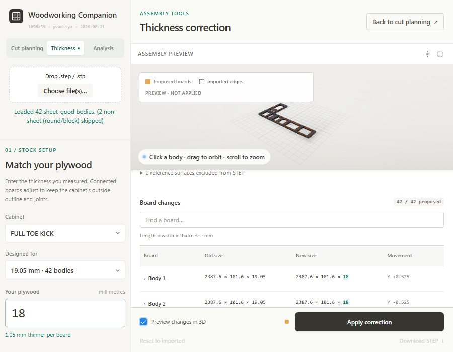

# Thickness workspace guide

Use **Thickness** to adapt an imported rectangular-board assembly to the
plywood you actually have. The app finds connected faces, adjusts board sizes
and positions, and checks that the outside outline and original joints remain
intact before allowing you to apply the result.

For a design made for 3/4-inch stock, enter **18 mm** as your measured target
when that is the thickness of your plywood. The nominal source is **19.05 mm**:
each board becomes 1.05 mm thinner. A rail between two fixed outside faces
may need an extra **2.10 mm** of length. Allowances follow the connections;
they are not added uniformly to every board.


## Correct a cabinet

1. **Import the STEP file.** Use the drop area or **Choose file(s)…**. You can
   import several cabinets; each has a separate correction state.
2. **Open Thickness.** Select the cabinet, then its **Designed for** stock
   group. The group lists the imported thickness and number of panels.
3. **Enter Your plywood.** Use the actual measured thickness in millimetres.
   These inputs and the change report use millimetres even when Cut planning
   displays inches.
4. **Analyse corrections.** This creates a proposal from the retained import.
   Check the contact count, outside outline, collisions, and maximum change
   in joint gap. An invalid proposal cannot be applied.
5. **Review the table and preview.** Search by board name. Expand a board's
   name to read why it changes. Enable **Preview changes in 3D** to compare
   proposed boards with the imported edges. Preview does not change the live
   cut list or the applied CAD.
6. **Apply correction.** The model and cutting dimensions update together.
   The app clears the thickness override and invalidates old nesting and
   structural results. Re-run those operations for the corrected geometry.
7. **Download STEP** to save the applied panel assembly, or return to
   **Cut planning** and choose **Estimate cut sheets**.

The source STEP file stays unchanged. **Reset to imported** restores the
cabinet's imported geometry and also invalidates results based on its previous
dimensions.

## Read the change table

| Column | Meaning |
|---|---|
| **Board** | Imported board name. Expand it for the constraints responsible for the edit. |
| **Old size** | Imported length × width × thickness, in mm. |
| **New size** | Proposed or applied length × width × thickness, in mm. Changed values are highlighted. |
| **Movement** | Change in the board centre along world X, Y, and Z, in mm. `—` means no displayed movement. |

Length and width retain their original in-plane axis order for comparison;
the report does not swap those axes just because a corrected dimension grows
past another. Positive and negative movement values indicate direction, not
material added or removed. Sizes are displayed to at most three decimal places.

The report count says **proposed** or **applied**. It includes boards whose
dimensions or positions changed; the corrected STEP includes all supported
panels in that cabinet, including unchanged panels.

## Understand the states

| Action or state | What it changes |
|---|---|
| Change a setting | Clears the previous proposal and temporary preview. Previously applied geometry stays in place. |
| Analyse | Calculates a new proposal from the original import. |
| Preview | Shows temporary geometry only; the legend says it is not applied. |
| Apply | Replaces that cabinet's previous correction and updates cutting inputs. |
| Download STEP | Exports the applied geometry, even if new settings have been entered but not applied. |
| Reset | Restores the imported geometry for the selected cabinet. |
| Switch workspace | Ends the temporary preview while retaining the proposal and applied state. |

Only the selected source stock group receives the new thickness, but connected
boards in other groups may need length or position adjustments. Each proposal
starts from the import, so applying again replaces the previous correction;
it does not accumulate allowances or corrections to multiple stock groups.

The workspace choice is remembered. This is not a saved CAD project: imported
models and corrections are session state. Download the applied STEP before
closing or reloading the app if you need to retain that result.

## Controls and layout

Cut planning's **Thickness override** changes the thickness used for nesting
and stock grouping. It does not resize or move CAD boards. The Thickness
workspace performs the geometry correction described here.

Stock settings stay on the left. The centre is the assembly view, and the
review scrolls independently of its Apply, Reset, and Download controls.
Narrower screens stack the review beneath the viewer.



The workspace tabs support Left/Right arrows and Home/End when focused.
Thickness is unavailable while a shared model operation, structural solve,
or viewer capture is active; it becomes available when that operation ends.
**Back to cut planning** returns to the cutting workflow.

## Contact tolerance and unsupported models

The default **Contact tolerance** is **0.05 mm**. The value must be positive
and no larger than **0.5 mm**. It is used both to match the source thickness
group and to recognise adjacent faces. Existing small contact gaps are
preserved. Increasing this tolerance is not a general repair for missing
joints or incorrect geometry.

Automatic correction currently requires closed rectangular board solids in
a common orthogonal assembly frame. The complete assembly can be rotated
relative to world axes. Shaped joinery, holes, pockets, notches, curved solids,
pre-existing overlaps, and incompatible exterior constraints need CAD review.

The solver protects the projected outside outline, including concave returns,
and the exposed exterior references it can infer. Internal openings can
change. Ambiguous anchors or constraints that cannot coexist block Apply;
there is no manual anchor editor or override for failed validation.

Zero-thickness reference surfaces are identified and listed separately. They
are excluded from the panel-solid STEP. Unsupported nonzero solids block the
correction rather than silently disappearing from the output.

| What you see | What to do |
|---|---|
| Analyse unavailable | Finish the active operation, select a cabinet and stock group, and check the numeric inputs. |
| Correction needs review | Read the reported faces/bodies and constraints; correct the source CAD or settings and analyse again. |
| No geometry changes needed | The proposal makes no size or position changes, so there is nothing to apply. |
| Apply becomes unavailable after editing a setting | Analyse the new settings to create a current proposal. |
| Download unavailable | Apply a valid correction first. Preview alone does not produce an applied assembly. |
| Cut layout or analysis results disappear | Applying or resetting invalidates results made from earlier geometry. Re-estimate or solve again. |

## What the STEP contains

The download contains positioned panel solids in the source file's coordinate
system. Display spacing between imported cabinets and floor offsets are
removed. It preserves assembly placement, but does not recreate the original
CAD application's feature history, sketches, or parametric constraints.

This differs from the Cut planning export of **unplaced parts**, which lays
those parts out separately. Thickness **Download STEP** always refers to the
selected cabinet's applied correction.

## Benchmark and verification

The supplied `FULL TOE KICK.stp` was checked from **19.05 → 18 mm**:

- 42 panels corrected; 126 face contacts retained.
- Zero measured joint-gap change, outside-reference error, or collisions.
- Two reference surfaces disclosed and excluded from panel-solid export.
- Export re-imported through OpenCascade to verify panel dimensions and positions.
- Corrected panels fitted on two 48 × 96-inch sheets in Repeated long rips
  mode, with 12.7 mm margin, 1.8 mm kerf, and 256 trials.

These are results for that model and settings, not a guarantee for every CAD
assembly. From the repository root, reproduce the CAD benchmark with:

```sh
node tests/thickness_bench.mjs "path/to/FULL TOE KICK.stp" 18
```

The fixture uses 19.05 mm as its source stock. It writes the corrected STEP and
a JSON report into the ignored `tests/_output/` directory. With the app running
and Python Playwright installed, run the toe-kick browser workflow with:

```sh
python tests/thickness_ui.py "path/to/FULL TOE KICK.stp" http://localhost:5173
```

For general regression tests, run `npm test` from `app/`. See
[ARCHITECTURE](ARCHITECTURE.md#stage-25-optional-thickness-correction), the
[solver design](thickness-correction-design.md), and the
[implementation record](thickness-correction-plan.md) for technical details.
