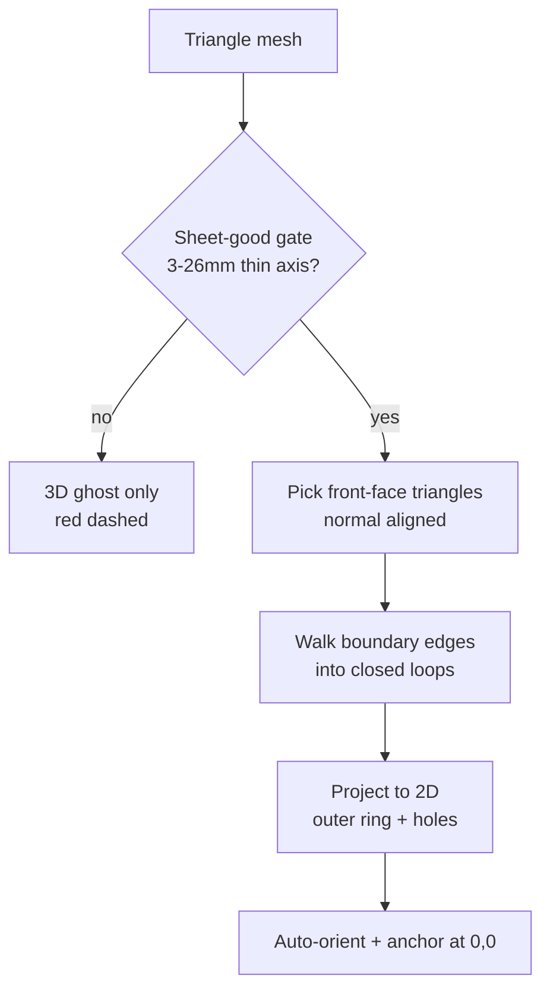
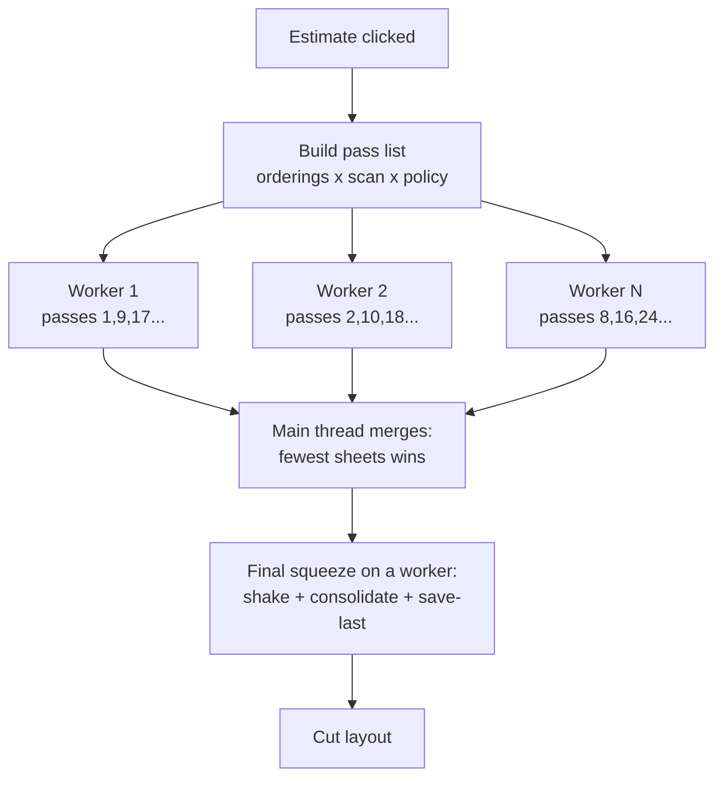
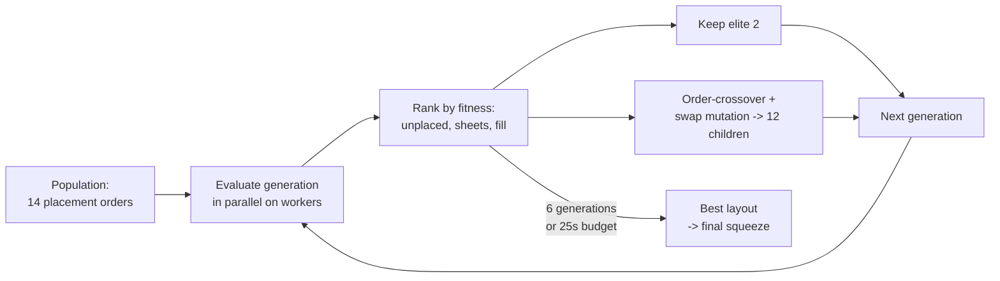
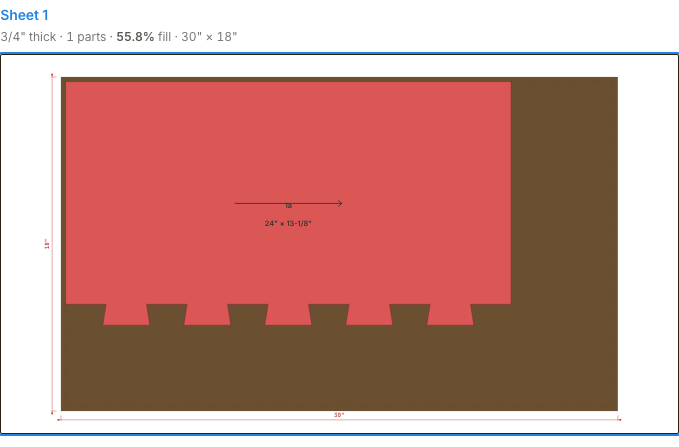
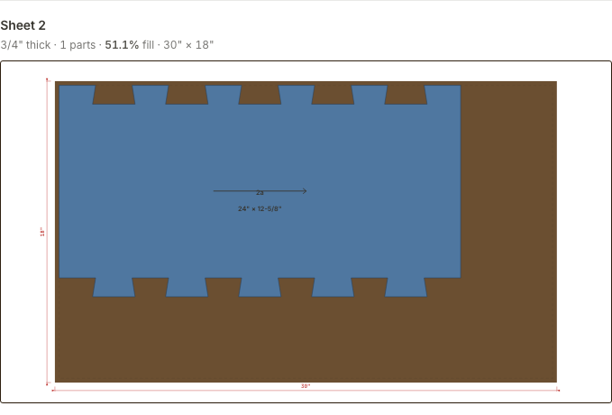
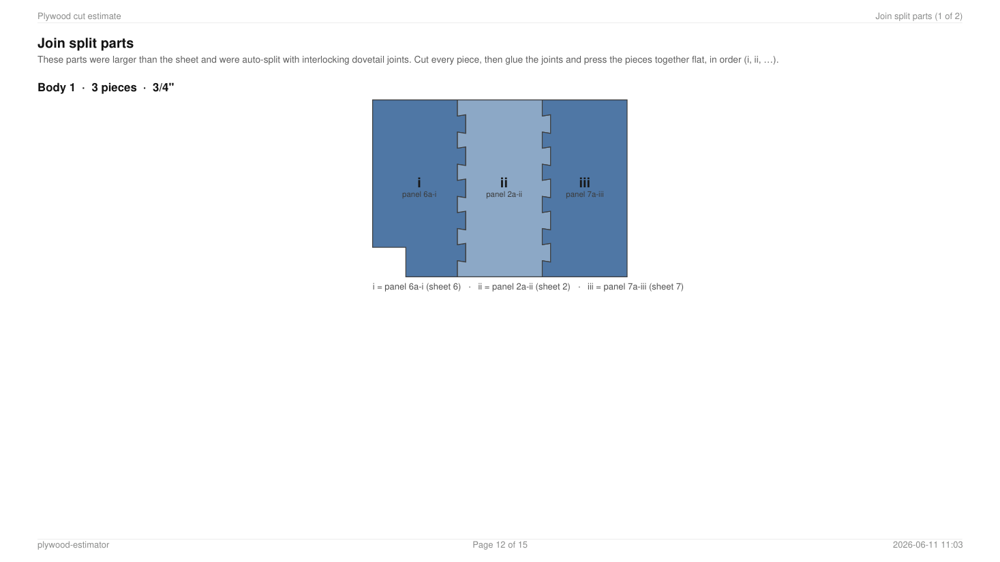
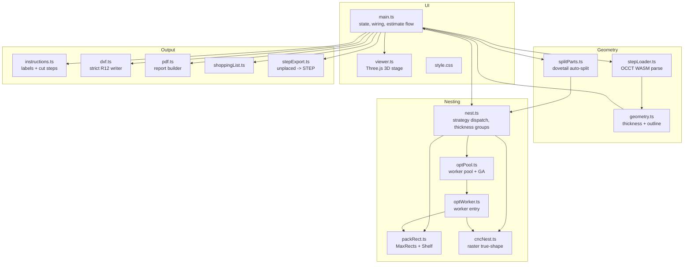

# Plywood Estimator — How It All Works

*A plain-language white paper covering every stage of the app, from dropping
a STEP file to downloading cut-ready files. Diagrams are
[Mermaid](https://mermaid.js.org/) — GitHub renders them inline.*

---

## 1. What the app does

You drop CAD files (STEP) containing furniture or cabinet models. The app
finds every plywood panel inside them, figures out each panel's true
thickness and 2D outline, then packs all the panels onto stock sheets
(4×8 ft by default) as tightly as it can. You get back:

- an interactive **cut layout** (one diagram per sheet),
- a **shopping list** (how many sheets of each thickness to buy, with cost),
- **DXF** files a CNC router / waterjet / saw shop can use directly,
- a multi-page **PDF report** (cut sequences, assembly steps, labels),
- a **STEP** file of any parts that didn't fit.

Everything runs in the browser — there is no server. The heavy math
(parsing, nesting) runs in WebAssembly and Web Workers on your own CPU.

---

## 2. From CAD file to panel list

### 2.1 Parsing and tessellation

STEP files describe exact curved surfaces (B-splines, arcs). The browser
can't use those directly, so OpenCascade (compiled to WebAssembly) converts
each solid body into a triangle mesh. Two settings control how faithful
that conversion is, and they are tuned for cutting tolerance:

| Setting | Value | Meaning |
|---|---|---|
| Linear deflection | **0.1 mm** absolute | no tessellated edge strays more than 0.1 mm from the true curve |
| Angular deflection | **0.2 rad (~11°)** | small-radius features (hinge holes) get enough segments regardless |

0.1 mm is far inside what a saw or router can hold, so downstream the
polylines are treated as exact. (True spline pass-through isn't possible —
the WASM importer only outputs triangles.)

### 2.2 Is this body a plywood panel?

Each body is gated before it reaches the cut list:

- its thinnest dimension must be **3–26 mm** (1/8"–1" stock), and
- the thinnest dimension must be well under half the next dimension
  (a block or a dowel is not a panel).

**Tilted panels** would fool a naive measurement: a 1/2" panel leaning 2°
measures ~7/8" along world axes because the measurement captures a slice of
the panel's own length. So the app always also computes an
orientation-independent bounding box (via PCA) and trusts its thickness
when it is meaningfully thinner. Bodies that fail the gate (legs, dowels,
hardware) still display in 3D — red dashed — but stay out of the nest.

### 2.3 Outline extraction

For each panel, the triangles facing "up" along the panel's normal form the
front face. Walking that face's boundary edges yields the panel's exact 2D
outline — outer ring plus holes — which is then auto-rotated so its dominant
edge direction is axis-aligned, and anchored at (0,0).

Importing many bodies shows a progress bar (parse → per-body analysis), and
the work yields to the browser so the page never freezes.

---

## 3. Choosing how to cut: the strategies

| Strategy | Machine | Packer | Objective |
|---|---|---|---|
| Max yield | anything | MaxRects | highest material use |
| **Min cuts** (default) | track / panel saw | Shelf (FFDH) | fewest edge-to-edge cuts |
| Max yield, save last sheet | anything | MaxRects + corner repack | clean reusable remnant |
| **CNC nest** | router / waterjet | raster true-shape | fewest sheets, any angle |
| CNC nest, save last sheet | router / waterjet | raster true-shape | + clean remnant |

The saw strategies pack each part's **bounding rectangle** (saws cut
straight lines), and every layout comes with a real, ordered cut sequence.
The CNC strategies pack the **actual silhouette** — parts may rotate to any
angle and may sit inside another part's hole — because a router cuts
continuous contours.

Parts are grouped by thickness (0.5 mm tolerance — float noise in
tessellation would otherwise split identical panels) and each thickness
group nests into its own stack of sheets.

---

## 4. The CNC nester, in depth

This is the most involved subsystem. It is a **raster** nester: geometry is
rasterised onto a grid of cells (~5–8 mm), and packing decisions are made on
that grid, while the exported contours stay exact.

### 4.1 Masks

Every part × rotation angle gets a **mask**: the set of grid cells its
silhouette covers. Key properties:

- **Conservative**: a cell is marked if the polygon overlaps *any* of it —
  two parts can never interpenetrate between cells.
- **Holes stay open**: a part's holes are NOT marked, so smaller parts can
  nest inside them.
- **Kerf halo**: when a part is placed, its mask *dilated by the kerf* is
  stamped into the sheet, so neighbours automatically keep a cutting gap —
  but the halo never blocks the sheet edge.
- **Simplified input, exact output**: masks rasterise from a
  Douglas-Peucker-simplified copy of the outline (collision quality is
  bounded by the cell size, not the curve tessellation); placements and all
  exports keep the exact 0.1 mm contours.

### 4.2 Placing one part

For each allowed angle, the nester scans the sheet bottom-to-top,
left-to-right for the first position where every mask cell lands on free
space. Three layers make this fast (measured **17×** on a 50-part job with
dense curved outlines — 22.9 s → 1.3 s):

1. **O(1) accept/reject** per position, via a summed-area table: an empty
   window accepts instantly; a window with fewer free cells than the mask
   needs rejects instantly.
2. **Boundary-first testing**: collisions happen at a mask's rim, so rim
   cells are tested first and crowded spots fail in a few probes.
3. **Resume cursors**: occupancy only ever grows, so a position proven
   infeasible for a shape stays infeasible. Instance #7 of a part resumes
   scanning where #6 stopped instead of at the origin.

Two **placement policies** compete (each optimiser pass uses one):

- **Bottom-left fill** — take the first feasible position (classic, best on
  rectangular mixes);
- **Touching-perimeter** — collect a few feasible candidates near the
  frontier and take the one whose fringe touches the most stock/edges
  (nests snugly, fewer unusable slivers — best on irregular parts).

### 4.3 The search: many passes, keep the best

A single greedy pass is mediocre. The optimiser runs **many full passes**,
each with a different part ordering (by area, longest side, perimeter,
width, height, big-small interleave, shuffles) × scan direction × placement
policy, and keeps the best result by: fewest unplaced → fewest sheets →
(save-last: emptiest last sheet) → most material used.

All passes are independent, so they fan out across a **Web Worker pool**
(one worker per CPU core, capped at 8). The single-core path remains as an
automatic fallback.

### 4.4 The final squeeze (where sheets get saved)

After the search picks a winner, two moves alternate until nothing improves:

- **Shake**: every sheet's own parts are re-packed from scratch toward the
  origin — scattered pockets merge into one contiguous free region.
- **Consolidate**: try to re-place ALL parts of the least-filled sheet onto
  the others (several victim candidates × scan directions × orderings). If
  they all fit, that sheet is dropped — one fewer sheet to buy.

This combination is what turns "three sheets with a nearly-empty third"
into two well-filled sheets: on the benchmark job, fills went from
75% / 69% / 10% to **84.5% / 69.6%**.

### 4.5 "Optimize further" — the genetic algorithm

The button next to the replay control runs a **deeper search seeded
differently on every click**, and only replaces your current layout if the
new one actually wins (fewest unplaced → fewest sheets → highest yield);
otherwise it restores the old layout and says so.

For CNC it runs a Deepnest-style **genetic algorithm**: a population of
placement orders is evaluated in parallel, the best survive, and the rest
are bred with order-crossover and swap mutations across generations —
evolution exploits structure in good orderings that blind shuffles can't.
It also unlocks a finer rotation step (7.5° instead of 15°).

### 4.6 Why not GPU?

Evaluated and rejected (for now): each placement mutates the occupancy
grid before the next part can be placed, so a GPU version needs a
GPU→CPU readback per placement — the round-trip latency eats the parallel
gain at this grid size. The parallelism that *is* free (independent passes)
already runs across all CPU cores.

---

## 5. Oversize parts: dovetail auto-split

A panel longer than the sheet can't nest. With **Auto-split oversize parts**
checked (CNC modes only), the app splits it into segments that *do* fit and
gives the mating edges interlocking dovetails so the segments reassemble
into the original panel. A CNC router cuts the dovetail contour for free.

How a split is decided:

1. **Where to cut** — perpendicular to the part's longest axis, into the
   minimum number of pieces such that each piece (tails included) fits the
   usable sheet. Pieces still too big the other way recurse.
2. **Notch avoidance** — nine candidate positions around the even split are
   scored by how much *material* the joint zone (cut line + tail depth)
   actually crosses; a cut that would land in a notch, or poke its tails
   into a hole, loses to a nearby solid position.
3. **How many tails** — the real joint length is measured at the chosen
   line; `tails = max(1, round(jointLen / 120 mm))`. The joint divides into
   `2·tails + 1` equal slots, alternating tail / gap with half-slot
   shoulders at the ends.
4. **Tail shape** — depth = `1.5 × thickness` (clamped 10–30 mm, never
   deeper than the tail is wide), with a 9° flare so the tip is wider than
   the base: the joint locks in-plane and assembles by dropping the mate in
   from above. Joints under 24 mm get a plain straight cut instead.
5. **One boolean partition** — piece A = part ∩ (left of the dovetail
   profile), piece B = the remainder. Zero gap, zero overlap, holes and
   outline features survive on whichever side they fall.

| On the sheet (tails) | On the sheet (sockets) |
|---|---|
|  |  |

Split segments are labelled with roman suffixes — `1a-i`, `2c-ii` — and the
PDF gains a **"Join split parts"** page that draws each original panel
reassembled from its labelled segments:

---

## 6. The saw-strategy packers (for completeness)

- **MaxRects** (Max yield): the classic maximal-rectangles packer — each
  placement splits the free space into up to four overlapping free
  rectangles, dominated ones pruned. Typically 85–95% yield on cabinet
  parts.
- **Shelf / FFDH** (Min cuts): parts pack into horizontal shelves; every
  shelf boundary is one full-sheet rip and every part boundary one
  crosscut — the fewest cuts a panel saw can achieve.
- **Skip-on-fail**: when a part doesn't fit the current sheet, the packer
  tries the *next part* rather than closing the sheet — one tall part
  shouldn't end a sheet with room left.
- **Consolidation**: like CNC, a finished layout gets a dissolve pass — the
  least-filled sheet's parts are re-inserted into the other sheets' free
  space (this saved a whole sheet on ~4% of randomized test jobs).
- All saw layouts carry a real **guillotine cut tree**, recovered even for
  MaxRects layouts, so the PDF's cut sequence is physically executable
  edge-to-edge cuts that never slice a neighbouring panel.

---

## 7. Exports

| Output | Details |
|---|---|
| **DXF** | Strict **R12** — classic `POLYLINE`/`VERTEX`/`SEQEND` (no R14 entities), full LTYPE/STYLE/BLOCKS tables, `$EXTMIN/$EXTMAX`. Two flavours: annotated (labels + dimensions) and **cut file** (contours only, for CAM). Validated against the strictest open-source DXF parser — old waterjet importers were rejecting a doubled `ENDSEC` the previous writer emitted. |
| **PDF** | Cover summary → shopping list → parts overview (saw modes) → one page per sheet (+ cut-sequence cards in saw modes) → join-split-parts guide (when parts were split) → per-cabinet assembly pages with IKEA-style step snapshots. CNC mode drops the saw-only sections. |
| **CSV** | Shopping list (thickness, need/have/buy, cost). |
| **STEP** | Unplaced parts only, regenerated from their exact outlines as extruded solids — re-nest them elsewhere. |

All geometry is **millimetres internally**; the UI converts at the
boundary (fractional inches at 1/16" by default). The world is Z-up.

---

## 8. Performance summary (measured)

| Scenario | Before | After |
|---|---|---|
| 50 complex parts, 4 CNC passes (single core) | 22.9 s | 1.3 s |
| Same, through the worker pool | — | well under a second per pass-batch |
| Benchmark stuck at 3 sheets | 3 sheets (75/69/10% fill) | **2 sheets** (84.5/69.6%) |
| Curved-part tessellation | ~2.5 mm chord error on big models | 0.1 mm everywhere |
| Import of many bodies | frozen UI | progress bar, responsive page |

Honest limitations:

- The raster grid quantises gaps between parts (~5 mm cells on the
  multicore path) — contours are exact, but spacing is conservative.
- Worker-pool runs can pick a different but objectively-equal layout from
  run to run (results arrive in nondeterministic order); the single-core
  fallback is fully deterministic.
- Jobs that are volume-bound (parts genuinely need N sheets) can't be
  improved by any search — "Optimize further" will tell you so rather than
  pretend.
- True B-spline export isn't possible from the tessellated importer; the
  0.1 mm polylines are equivalent at cutting tolerance.

---

## 9. Module map

*For maintainer-level, function-by-function detail see
[ARCHITECTURE.md](ARCHITECTURE.md); for working conventions and sharp edges
see [CLAUDE.md](CLAUDE.md).*
